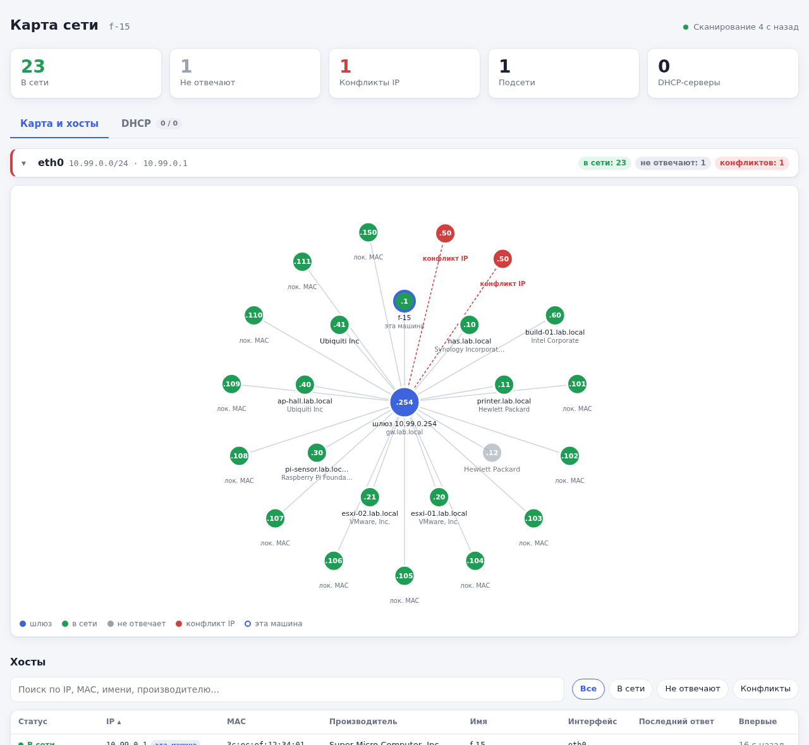
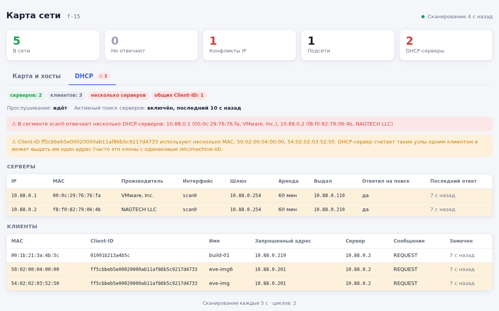

# net-map



**net-map** — служба, которая находит хосты в локальных подсетях ARP-запросами и показывает их в браузере:
карта каждой подсети, таблица хостов и лента событий. Для каждого хоста видны IP- и MAC-адрес, производитель
сетевой карты, имя из обратного DNS, шлюз по умолчанию и конфликты IP-адресов (когда на один IP отвечают
несколько MAC).

## Возможности

- Сканирование подсетей всех поднятых интерфейсов (или указанных в конфигурации) ARP-запросами: отвечают даже
  хосты, закрывшие ICMP.
- Обнаружение конфликтов IP: несколько MAC-адресов на одном IP, в том числе на адресе самой машины.
- Производитель по MAC-адресу (база IEEE OUI из пакета `ieee-data`), отметка локально администрируемых MAC
  (виртуальные машины, контейнеры, телефоны со случайным MAC).
- Имена хостов через обратный DNS (в отдельном потоке, с кэшем; недоступный DNS не тормозит сканирование).
- Шлюз по умолчанию из таблицы маршрутов.
- Наблюдение за DHCP: DHCP-серверы сегмента (предупреждение, если их несколько), клиенты с их Client-ID, именами
  и запрошенными адресами, предупреждение, если один Client-ID используют несколько MAC (клоны с одинаковым
  `/etc/machine-id` — DHCP-сервер выдаёт им один адрес). Необязательный активный поиск DHCP-серверов.
- События: новый хост, хост не отвечает, хост снова в сети, смена MAC у IP, конфликт IP и его устранение,
  новый DHCP-сервер, несколько DHCP-серверов, общий Client-ID. События пишутся в syslog.
- Веб-страница с общей сводкой и двумя вкладками: «Карта и хосты» (карта подсети — шлюз в центре, хосты
  вокруг, хосты с одинаковым IP рядом; таблица с поиском, фильтрами и сортировкой; лента событий) и «DHCP»
  (серверы, клиенты, предупреждения; открывается ссылкой `…/#dhcp`). Светлая и тёмная тема, автообновление.
- JSON API `/api/network`.

## Как это работает

Программа рассылает ARP-запрос «у кого этот IP?» на каждый адрес подсети интерфейса (раз в 2 мс) и собирает
ответы. Учитываются и ARP-запросы, которые отправляют другие хосты. Подсеть `/24` сканируется примерно за
1–2 секунды.

ARP работает только в пределах одного сегмента сети (L2): хосты за маршрутизатором не видны. Для отправки ARP
нужен сырой сокет, то есть право `CAP_NET_RAW`; права root целиком не нужны.

### DHCP



На каждом сканируемом интерфейсе открывается ещё один сокет `AF_PACKET` с BPF-фильтром ядра, который пропускает
в программу только DHCP (IPv4/UDP, порты 67/68). Видны широковещательные запросы клиентов (DISCOVER, REQUEST) и
широковещательные ответы серверов. Ограничения пассивного режима:

- ответы серверов конкретному клиенту обычно адресные и через коммутатор не видны, поэтому серверы могут быть
  не замечены без активного поиска;
- продление аренды клиент отправляет серверу напрямую, поэтому клиент виден при загрузке и при повторном
  получении адреса, а не при каждом продлении. Отсутствие DHCP-пакетов не означает статический адрес.

При `dhcp_probe: true` программа раз в `dhcp_probe_interval_sec` рассылает DHCPDISCOVER с флагом broadcast, и на
него отвечают все DHCP-серверы сегмента, в том числе чужие. В заголовке запроса указывается отдельный локально
администрируемый MAC, поэтому аренда самого интерфейса не затрагивается; DHCPREQUEST не отправляется, адрес не
занимается (сервер лишь ненадолго резервирует предложенный адрес). Это активное вмешательство в сеть, поэтому по
умолчанию поиск выключен.

## Требования

### Для сборки

- CMake 3.25+
- компилятор с поддержкой C++20 (GCC 12+)
- `fmt`
- `nlohmann-json`
- `googletest` — только для тестов

[cpp-httplib](https://github.com/yhirose/cpp-httplib) v0.18.7 встроен в проект (`third_party/httplib`),
`fmt` подключается в header-only режиме: во время работы нужны только системные библиотеки C/C++.

Debian 13:

```bash
apt install -y build-essential cmake dpkg-dev libfmt-dev nlohmann-json3-dev libgtest-dev
```

Astra Linux 1.8:

```bash
apt install -y build-essential cmake dpkg-dev libfmt11-dev nlohmann-json3-dev libgtest-dev
```

### Для работы

- `ieee-data` — база производителей по MAC-адресу (необязательно, без неё производитель не показывается).

## Сборка из исходников

```bash
cmake -S . -B build -DCMAKE_BUILD_TYPE=Release -DCMAKE_INSTALL_PREFIX=/usr
cmake --build build -j$(nproc)
ctest --test-dir build
```

Тесты можно не собирать: `-DBUILD_TESTS=OFF`.

Среди тестов есть интеграционные, которые строят изолированную сеть в пространствах имён Linux:

- `netns_scan` — мост и несколько «хостов», два из них с одинаковым IP; проверяются сканирование и веб-сервер;
- `netns_dhcp` — два DHCP-сервера (`dnsmasq`) и три клиента (`busybox udhcpc`), два из них с одинаковым
  Client-ID; проверяется обнаружение серверов активным поиском, клиентов и общего Client-ID.

Права root им не нужны (используется user namespace); там, где user namespace, `dnsmasq` или `busybox`
недоступны (например, в контейнере), тесты пропускаются.

## Запуск

```bash
sudo ./build/net-map configuration/cfg.json          # служба: сканирование и веб-сервер
sudo ./build/net-map --once configuration/cfg.json   # одно сканирование, таблица в консоль
```

Единственный аргумент, кроме `--once`, — путь к конфигурации, по умолчанию `/etc/net-map/cfg.json`.
Страница доступна по адресу `http://<хост>:8081/`.

Вместо `sudo` можно выдать бинарнику только нужное право: `sudo setcap cap_net_raw+ep ./build/net-map`.

## Сборка DEB

Пакет собирается через CPack. Собирать нужно на той же системе (или в контейнере с ней), куда пакет будет
устанавливаться: зависимости от `libc6` и `libstdc++6` подставляются по версиям сборочной системы.

```bash
cmake -S . -B build -DCMAKE_BUILD_TYPE=Release -DCMAKE_INSTALL_PREFIX=/usr -DBUILD_TESTS=OFF
cmake --build build -j$(nproc)
cd build && cpack -G DEB
apt install -y ./net-map_<версия>_amd64.deb
```

После установки будут размещены:

- бинарник: `/usr/bin/net-map`
- конфигурация: `/etc/net-map/cfg.json` (conffile — при обновлении пакета правки не затираются)
- unit systemd: `/usr/lib/systemd/system/net-map.service`
- лицензия: `/usr/share/doc/net-map/copyright`

При установке служба включается и запускается, при обновлении пакета перезапускается (если администратор её
не выключил), при удалении останавливается.

## Релизы

Сборка настроена в GitHub Actions (`.github/workflows/release.yml`): на каждый push и pull request в `master`
проект собирается в контейнере Debian 13, прогоняются тесты и собирается DEB-пакет (он доступен в артефактах
запуска). Готовые пакеты публикуются на странице
[Releases](https://github.com/khromenokroman/net-map/releases).

Чтобы выпустить релиз, нужно поставить тег `v<версия>`, совпадающий с версией в `CMakeLists.txt`, и отправить его:

```bash
git tag v0.6.0.0
git push origin v0.6.0.0
```

Если тег не совпадает с версией, сборка останавливается. Пакет для Astra Linux в GitHub Actions не собирается
(нет публичного образа), его нужно собрать на Astra и приложить к релизу вручную.

## Запуск как служба

```bash
systemctl status net-map
systemctl restart net-map     # после изменения конфигурации
journalctl -u net-map
```

Служба запускается от динамического пользователя (`DynamicUser=yes`) с единственным правом `CAP_NET_RAW` и
ограничениями `ProtectSystem=strict`, `NoNewPrivileges`, фильтром системных вызовов `@system-service` и т.д.
Поэтому порт должен быть не меньше 1024. Если нужен порт 80, добавьте через `systemctl edit net-map`:

```ini
[Service]
AmbientCapabilities=CAP_NET_RAW CAP_NET_BIND_SERVICE
CapabilityBoundingSet=CAP_NET_RAW CAP_NET_BIND_SERVICE
```

## Конфигурация

Пример `/etc/net-map/cfg.json`:

```json
{
  "listen_addr": "0.0.0.0",
  "port": 8081,
  "log_level": 6,
  "interfaces": [],
  "scan_interval_sec": 60,
  "host_timeout_sec": 600,
  "arp_timeout_ms": 1000,
  "max_hosts": 4096,
  "oui_file": "/usr/share/ieee-data/oui.txt",
  "dhcp_watch": true,
  "dhcp_probe": false,
  "dhcp_probe_interval_sec": 3600
}
```

Все поля необязательны.

| Параметр            | По умолчанию                     | Описание                                                                     |
|---------------------|----------------------------------|------------------------------------------------------------------------------|
| `listen_addr`       | `"0.0.0.0"`                      | Адрес, на котором слушает HTTP-сервер                                        |
| `port`              | `8081`                           | Порт HTTP-сервера, 1–65535                                                   |
| `log_level`         | `6`                              | Уровень логирования syslog, 0–7 (6 — `LOG_INFO`, 7 — `LOG_DEBUG`)            |
| `interfaces`        | `[]`                             | Интерфейсы для сканирования; пусто — все поднятые интерфейсы с поддержкой ARP |
| `scan_interval_sec` | `60`                             | Период сканирования, секунд (5–86400)                                        |
| `host_timeout_sec`  | `600`                            | Через сколько секунд без ответа хост считается пропавшим (10–2592000)        |
| `arp_timeout_ms`    | `1000`                           | Сколько ждать ответов после рассылки запросов, мс (100–10000)                |
| `max_hosts`         | `4096`                           | Подсети с большим числом адресов пропускаются (1–65536)                      |
| `oui_file`          | `/usr/share/ieee-data/oui.txt`   | База производителей по MAC-адресу                                            |
| `dhcp_watch`        | `true`                           | Прослушивать DHCP на сканируемых интерфейсах                                 |
| `dhcp_probe`        | `false`                          | Периодически рассылать DHCPDISCOVER для поиска DHCP-серверов                 |
| `dhcp_probe_interval_sec` | `3600`                     | Период активного поиска DHCP-серверов, секунд (60–86400)                     |

Хосты, не отвечающие больше суток, удаляются из списка. Обратный DNS использует системный резолвер; если
переменная окружения `RES_OPTIONS` не задана, программа выставляет `timeout:1 attempts:1`.

## HTTP API

`GET /` — страница с картой сети.

`GET /api/network` — состояние сети в JSON (сокращённый пример):

```json
{
  "hostname": "f-15",
  "time": 1790244000000,
  "scan_interval_sec": 60,
  "scans": 12,
  "last_scan": 1790243990000,
  "warnings": [],
  "subnets": [
    { "iface": "eth0", "subnet": "10.99.0.0/24", "addr": "10.99.0.1", "mac": "3c:ec:ef:12:34:01", "gateway": "10.99.0.254" }
  ],
  "hosts": [
    {
      "ip": "10.99.0.254", "mac": "d4:01:c3:b6:f2:ca", "vendor": "Routerboard.com", "hostname": "gw.lab.local",
      "iface": "eth0", "subnet": "10.99.0.0/24", "first_seen": 1790243300000, "last_seen": 1790243990000,
      "self": false, "gateway": true, "online": true, "conflict": false, "local_mac": false
    }
  ],
  "events": [
    { "time": 1790243300000, "kind": "ip_conflict", "text": "Конфликт IP 10.99.0.50: отвечают ...", "ip": "10.99.0.50", "mac": "50:02:00:04:00:00" }
  ],
  "dhcp": {
    "watching": true, "probing": true, "last_probe": 1790243300000,
    "servers": [
      { "ip": "10.99.0.254", "mac": "d4:01:c3:b6:f2:ca", "vendor": "Routerboard.com", "iface": "eth0", "first_seen": 1790243300000,
        "last_seen": 1790243300000, "router": "10.99.0.254", "lease": 3600, "prefix": 24, "last_offered": "10.99.0.110",
        "messages": 3, "answered_probe": true }
    ],
    "clients": [
      { "mac": "54:02:02:03:52:50", "client_id": "ff5cbbeb5e00020000ab11af86b5c9217d4733", "hostname": "eve-img", "vendor_class": "",
        "iface": "eth0", "first_seen": 1790243300000, "last_seen": 1790243300000, "requested_ip": "10.99.0.201",
        "server_id": "10.99.0.254", "last_type": "REQUEST", "shared_client_id": true }
    ],
    "shared_client_ids": { "ff5cbbeb5e00020000ab11af86b5c9217d4733": ["50:02:00:04:00:00", "54:02:02:03:52:50"] }
  }
}
```

- Время — миллисекунды от эпохи Unix; `0` — ещё не было.
- `kind` события: `new_host`, `host_lost`, `host_back`, `mac_changed`, `ip_conflict`, `conflict_resolved`,
  `dhcp_server`, `dhcp_multiple_servers`, `dhcp_shared_client_id`.
- У хостов есть также `dhcp_hostname` и `client_id` — из DHCP-запросов с тем же MAC.
- `dhcp.shared_client_ids` — Client-ID, которые используют несколько MAC.
- `warnings` — пропущенные интерфейсы и ошибки последнего сканирования (например, нет права `CAP_NET_RAW`).

## Логирование

Программа пишет в syslog с тегом `net-map`:

```bash
journalctl -t net-map
```

Конфликт IP, смена MAC, несколько DHCP-серверов и общий Client-ID пишутся с приоритетом `LOG_WARNING`,
пропажа хоста и устранение конфликта — `LOG_NOTICE`, новые хосты и DHCP-серверы — `LOG_INFO`.

## Лицензия

[GNU GPL v3.0 или более поздняя](LICENSE). Встроенный cpp-httplib (`third_party/httplib`) распространяется
под лицензией MIT.
